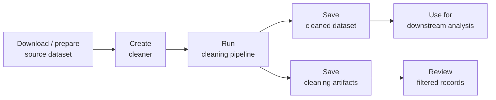

# Common Workflow

## Workflow Overview

## Workflow Steps

Most dataset cleaners follow the same workflow:

1. Download or prepare the source dataset.
2. Create a dataset-specific cleaning pipeline with `create_*_cleaner`.
3. Run the cleaning pipeline with `clean_*_dataset`.
4. Save the cleaned standardized dataset.
5. Save cleaning artifacts for reproducibility.
6. Optionally export cleaning artifacts to CSV files for inspection.

## Returned Objects

The cleaning process usually returns two objects:

- `cleaning_pipeline`: the fitted cleaning pipeline, including intermediate cleaning artifacts.
- `cleaned_dataset`: the standardized cleaned dataset that can be saved and used for downstream analysis.
